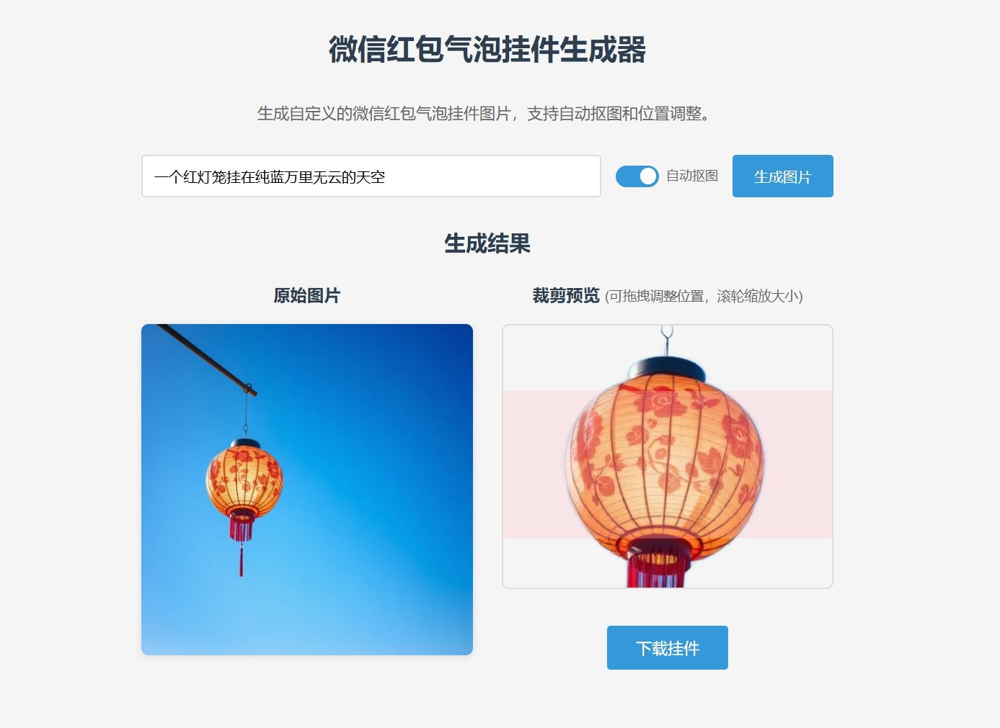

# 微信红包气泡挂件生成器

使用硅基流动文生图模型，支持自动抠图和位置调整。


## 挂件规格

格式：PNG  
宽高：480x384像素  
文件大小：不超过300KB  

# 抠图需要手动安装模型

```shell
pip install git+https://github.com/RimoChan/modnet-entry.git
```

效果展示




###  硅基流动注册

可以的话注册使用我的链接：https://cloud.siliconflow.cn/i/5ObwfSCD

可获赠2000万Tokens（14元平台配额）